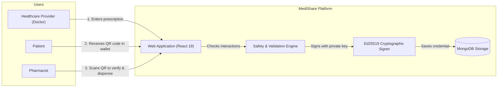
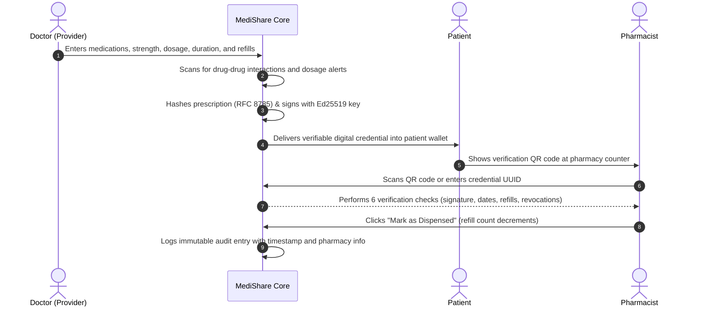
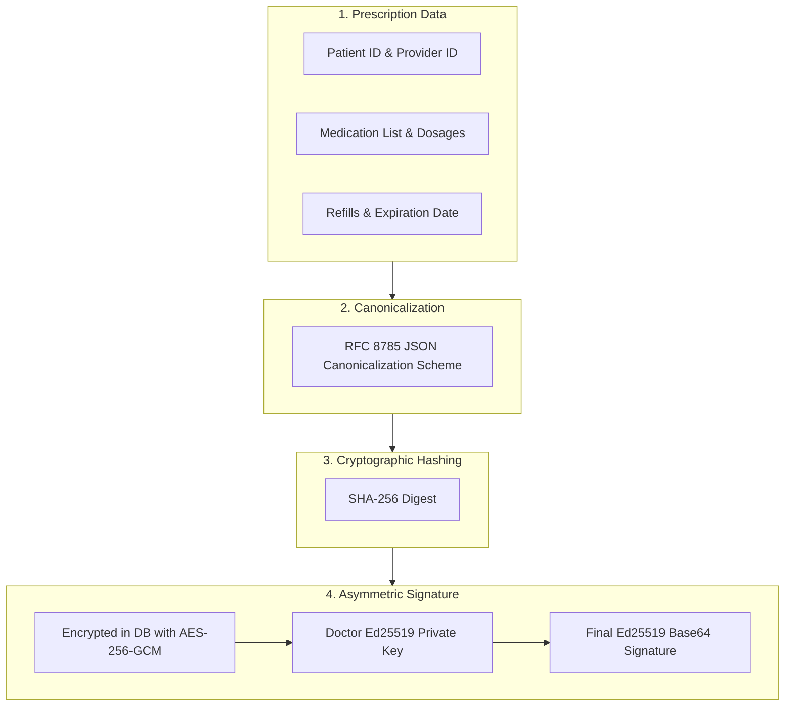

# MediShare

**Decentralized, Privacy-Preserving Digital Prescription Credentials**

[](https://www.typescriptlang.org/)
[](https://react.dev/)
[](https://www.mongodb.com/)
[](https://tailwindcss.com/)
[-blueviolet.svg)](https://eslint.org/)
[](LICENSE)

---

## Table of Contents

1. [Overview](#overview)
2. [The Real-World Problem & Solution](#the-real-world-problem--solution)
3. [How MediShare Works](#how-medishare-works)
4. [Core Features in Detail](#core-features-in-detail)
5. [User Roles & Permissions](#user-roles--permissions)
6. [Pre-Configured Demo Accounts](#pre-configured-demo-accounts)
7. [Step-by-Step Quick Start](#step-by-step-quick-start)
8. [System Architecture & Cryptography](#system-architecture--cryptography)
9. [Open Standards: W3C & HL7 FHIR](#open-standards-w3c--hl7-fhir)
10. [API Reference](#api-reference)
11. [Project Directory Structure](#project-directory-structure)
12. [Frequently Asked Questions (FAQ)](#frequently-asked-questions-faq)
13. [Docker Deployment](#docker-deployment)
14. [License](#license)

---

## Overview

**MediShare** is a healthcare credentialing platform that replaces paper prescriptions with digitally signed, verifiable medical credentials. 

Using **Ed25519 asymmetric cryptography**, licensed healthcare providers issue tamper-evident prescriptions directly to a patient's digital wallet. When a patient arrives at a pharmacy, the pharmacist scans a QR code to verify authenticity in milliseconds without needing phone calls, fax machines, or shared database passwords.

---

## The Real-World Problem & Solution

### The Problem with Traditional Paper Prescriptions
* **Easy to Forge**: Anyone with a color printer can duplicate prescription pads or modify dosages.
* **Double-Dispensing ("Doctor Shopping")**: Patients can present the same paper prescription to multiple pharmacies before anyone notices.
* **Dangerous Drug Mixtures**: Paper cannot check whether a newly prescribed drug conflicts with another medicine the patient is taking.
* **Lost or Damaged Paper**: Lost slips require clinic visits and telephone verifications, wasting clinical hours.

### How MediShare Solves It
* **Cryptographic Locks**: Every prescription is hashed and digitally signed with the doctor's private cryptographic key. If even a single character is changed, the verification check fails.
* **Automated Dispensation Tracking**: When a pharmacist dispenses medication, the system logs the event and updates remaining refills in real time.
* **Live Drug Interaction Alerts**: The system automatically scans for dangerous drug-drug conflicts and lethal dosage limits before the prescription is issued.
* **Universal Access**: Patients keep their prescription on their phone as a QR code, or take a printable vector PDF that contains the cryptographic verification code.

---

## How MediShare Works

### High-Level Flow



---

### The Prescription Lifecycle



---

## Core Features in Detail

### 1. Cryptographic Tamper Detection
Every prescription is serialized according to **RFC 8785 (JSON Canonicalization Scheme)** and hashed with SHA-256 before being signed with the doctor's **Ed25519 private key**. 
* If a third party changes `5 mg` to `50 mg`, the signature check fails immediately.
* MediShare includes a built-in **Visual Diff Tool** that compares the original signed content against current database records to highlight exact field alterations.

### 2. Built-In Drug Interaction & Safety Engine
Before a doctor issues a prescription, the system automatically runs safety checks against an internal clinical rules engine:
* **Drug-Drug Interactions**: Flags severe combinations (e.g., Warfarin + Aspirin increases fatal bleeding risks; Simvastatin + Clarithromycin).
* **Maximum Daily Dosage Guards**: Flags excessive doses (e.g., Amoxicillin exceeding 3000 mg/day, Acetaminophen exceeding 4000 mg/day).
* **Duplicate Active Ingredient Detection**: Prevents accidental double-prescribing.
* **FDA Black-Box Warnings**: Displays prominent warnings for controlled substances and high-risk medications.

### 3. Patient Digital Wallet
Patients log in to see a personal dashboard displaying all their digital credentials:
* Active, completed, and expired prescriptions organized clearly.
* Full medication instructions (dosage, schedule, refills remaining).
* Instant full-screen **QR Code Generator** for presenting at pharmacy counters.
* Downloadable **Printable Medical PDF** containing high-resolution verification QR codes for patients without smartphones.

### 4. Pharmacist Verification Portal
Pharmacists verify prescriptions in two ways without needing a MediShare user account:
* **Camera Scanner**: Scans patient QR codes directly through browser webcam or mobile phone camera.
* **Manual UUID Input**: Accepts the 36-character unique credential UUID (with one-click autofill for testing).
* **Automated Dispensation**: Records pharmacy name, timestamp, and decrements remaining refills. If refills reach zero, the status changes to `DISPENSED` and further dispensations are prevented.

### 5. Multi-Language Accessibility (i18n)
Full internationalization supporting 5 languages:
* **English** (en)
* **Hindi** (hi) — हिन्दी
* **Gujarati** (gu) — ગુજરાતી
* **Arabic** (ar) — العربية (with full Right-to-Left / RTL layout orientation)
* **French** (fr) — Français

---

## User Roles & Permissions

| Role | Primary Dashboard | Key Permissions |
|---|---|---|
| **Provider (Doctor)** | `/provider` | Write prescriptions, view patient history, issue cryptographic credentials, revoke compromised prescriptions |
| **Patient** | `/patient` | View credential wallet, generate presentation QR codes, download printable vector PDF |
| **Pharmacist** | `/verify` | Public access: scan QR codes, verify 6-point cryptographic check, record dispensations |
| **Admin** | `/admin` | Approve pending provider licenses, inspect system audit trail, monitor platform health |

---

## Pre-Configured Demo Accounts

All pre-seeded demo accounts share the password: **`password123`**

| Role | Email | Password | What You Can Test |
|---|---|---|---|
| **Doctor** | `dr.sharma@medishare.com` | `password123` | Create prescriptions with multiple medications, test drug warnings |
| **Doctor (Pending)** | `dr.williams@medishare.com` | `password123` | View pending approval state |
| **Patient** | `john.doe@medishare.com` | `password123` | View active prescription credentials & QR presentation |
| **Pharmacist** | `pharmacist@medishare.com` | `password123` | Verify sample credential `c9c52004-6fb3...` and dispense |
| **Admin** | `admin@medishare.com` | `password123` | Approve `dr.williams`, inspect full audit log |

---

## Step-by-Step Quick Start

### Prerequisites
* **Node.js** v20 or v22 LTS ([nodejs.org](https://nodejs.org/))
* **MongoDB** 7.0 running locally on port `27017` (e.g. MongoDB Compass or Community Server)

---

### Step 1: Clone and Install
```bash
git clone https://github.com/<your-username>/medishare.git
cd medishare
npm install
```

### Step 2: Set Environment Variables
Copy the `.env.example` template:
```bash
# macOS / Linux:
cp .env.example .env

# Windows PowerShell:
Copy-Item .env.example .env
```

Your default `.env` is configured for local development:
```env
MONGODB_URI=mongodb://127.0.0.1:27017
MONGODB_DB_NAME=medishare
NODE_ENV=development
JWT_SECRET=your-secure-jwt-secret-at-least-32-chars-long
REFRESH_SECRET=your-secure-refresh-secret-at-least-32-chars-long
KEY_ENCRYPTION_KEY=your-secure-kek-key-at-least-32-chars-long
```

### Step 3: Initialize Indexes & Seed Data
Run the index initialization and seed script to generate 1+ year of realistic medical data:
```bash
# Creates 14 database indexes (uniqueness & query acceleration)
node scripts/setup-indexes.js

# Seeds doctors, patients, prescriptions, and cryptographic keys
node scripts/seed.js
```

### Step 4: Start the Application
```bash
npm run dev
```

Open **`http://localhost:5173`** in your web browser.

---

## System Architecture & Cryptography



### Verification Pipeline
When a pharmacist verifies a credential, MediShare executes **6 sequential validation checks**:
1. **Issuer Public Key Resolution**: Resolves the doctor's public key from the database or DID document.
2. **Cryptographic Signature Verification**: Reconstructs the canonical hash and verifies the signature using Ed25519.
3. **Revocation Registry Check**: Confirms the credential has not been revoked by the prescriber.
4. **Expiration Date Check**: Verifies the prescription timestamp has not lapsed.
5. **Dispensation & Refill Audit**: Checks if remaining refills are greater than zero.
6. **Provider License Status**: Validates that the issuing doctor has an active, approved license.

---

## Open Standards: W3C & HL7 FHIR

MediShare is built from the ground up to support international healthcare interoperability:

### 1. W3C Verifiable Credentials (VC v1.1)
Export any credential as a standard W3C Verifiable Credential:
```json
{
  "@context": [
    "https://www.w3.org/2018/credentials/v1",
    "https://w3id.org/health/v1"
  ],
  "id": "urn:uuid:c9c52004-6fb3-4654-8fbd-2bd360802816",
  "type": ["VerifiableCredential", "PrescriptionCredential"],
  "issuer": "did:web:medishare.example:provider:68a1b2...",
  "issuanceDate": "2026-08-15T10:00:00Z",
  "credentialSubject": {
    "patient": "PAT-1001",
    "medications": [
      {
        "medication": "Amoxicillin",
        "strength": "500 mg",
        "dosage": "1 capsule 3 times daily",
        "duration": "10 days",
        "refills": 1
      }
    ]
  },
  "proof": {
    "type": "Ed25519Signature2020",
    "created": "2026-08-15T10:00:00Z",
    "verificationMethod": "did:web:medishare.example:provider:68a1b2#key-1",
    "proofValue": "3bA9x...kL2m=="
  }
}
```

### 2. HL7 FHIR R4 Bundle
Export any prescription as an HL7 FHIR R4 `MedicationRequest` Bundle containing FHIR-compliant resources (`Patient`, `Practitioner`, `MedicationRequest`) for hospital EHR integration.

---

## API Reference

The backend exposes 22 secure REST API routes:

| Method | Endpoint | Access | Purpose |
|---|---|---|---|
| `POST` | `/api/auth/register` | Public | Create new patient or provider account |
| `POST` | `/api/auth/login` | Public | Authenticate user & receive JWT |
| `POST` | `/api/auth/refresh` | Public | Refresh expired access token via HTTP-only cookie |
| `GET` | `/api/prescriptions` | Provider / Admin | List prescriptions with search and date filters |
| `POST` | `/api/prescriptions` | Provider | Create and sign a new multi-item prescription |
| `GET` | `/api/credentials` | Authenticated | List verifiable credentials for user |
| `GET` | `/api/credentials/:id` | Authenticated | Fetch specific credential details |
| `GET` | `/api/credentials/:id/qr` | Authenticated | Generate verification QR code data |
| `GET` | `/api/credentials/:id/export/vc` | Authenticated | Export as W3C Verifiable Credential |
| `GET` | `/api/credentials/:id/export/fhir` | Authenticated | Export as HL7 FHIR R4 Bundle |
| `GET` | `/api/credentials/:id/compare` | Provider / Admin | Detect tampering & view field diffs |
| `POST` | `/api/credentials/:id/revoke` | Provider / Admin | Revoke credential with reason code |
| `POST` | `/api/verify/init` | Public | Request verification challenge nonce |
| `POST` | `/api/verify/exchange` | Public | Verify cryptographic signature and return result |
| `GET` | `/api/verify/:credentialId` | Public | Quick lookup of verification record |
| `POST` | `/api/dispensations` | Public | Record medication dispensation and update refills |
| `GET` | `/api/dispensations/:id` | Public | Retrieve dispensation receipt history |
| `GET` | `/api/providers` | Authenticated | List approved healthcare providers |
| `GET` | `/api/providers/pending` | Admin | List providers awaiting credential approval |
| `POST` | `/api/providers/:id/approve` | Admin | Approve provider license |
| `GET` | `/api/patients` | Provider / Admin | List registered patients |
| `GET` | `/api/admin/stats` | Admin | Get platform metrics (totals, active, revoked) |
| `GET` | `/api/audit` | Provider / Admin | Searchable audit trail of all actions |

---

## Project Directory Structure

```
medishare/
├── .github/workflows/ci.yml       # GitHub Actions CI/CD test & build pipeline
├── api/                           # Backend API handlers (Node.js)
│   ├── admin/                     # System statistics & provider approvals
│   ├── audit/                     # Immutable audit logging endpoints
│   ├── auth/                      # Authentication & token refresh
│   ├── credentials/               # Credential CRUD & W3C/FHIR export
│   ├── dispensations/             # Medication dispensation tracking
│   ├── patients/                  # Patient directory lookup
│   ├── prescriptions/             # Prescription creation & signing
│   ├── providers/                 # Provider directory & key management
│   ├── verify/                    # Public QR verification exchange
│   ├── crypto-utils.js            # Ed25519 signing & AES-256-GCM encryption
│   ├── db-client.js               # MongoDB connection pool & index bootstrapper
│   ├── env-check.js               # Startup environment diagnostics
│   └── utils.js                   # JWT, rate limiting, and security headers
├── public/                        # Static assets, favicon, and translations
│   └── locales/                   # i18n JSON files (en, hi, gu, ar, fr)
├── scripts/                       # Automation and setup utilities
│   ├── seed.js                    # 1-year realistic demo data seeder
│   ├── setup-indexes.js           # 14 MongoDB index setup script
│   └── test-api-routes.js         # Comprehensive 22-route API verification
├── src/                           # Frontend application (React 19 + Vite)
│   ├── components/                # Reusable UI components
│   │   ├── EmptyState.tsx         # Branded interactive empty state cards
│   │   ├── ErrorBoundary.tsx      # React crash handler & exception boundary
│   │   ├── FieldDiff.tsx          # Visual cryptographic tamper diff viewer
│   │   ├── Layout.tsx             # Navbar, mobile drawer & footer
│   │   ├── PrescriptionPdf.tsx    # Printable vector medical prescription PDF
│   │   ├── QrDisplay.tsx          # QR Code presentation component
│   │   ├── QrScanner.tsx          # Camera QR scanner component
│   │   └── Skeleton.tsx           # Layout-preserving shimmer loaders
│   ├── contexts/                  # AuthContext and ToastContext
│   ├── lib/                       # Client utilities & drug safety engine
│   ├── pages/                     # 13 lazy-loaded route views
│   │   ├── AdminDashboard.tsx     # Admin management console
│   │   ├── AuditTrail.tsx         # System audit history viewer
│   │   ├── CredentialView.tsx     # Detailed credential inspection
│   │   ├── NotFound.tsx           # Custom 404 page
│   │   ├── PatientDashboard.tsx   # Patient prescription wallet
│   │   ├── PharmacistVerify.tsx   # Pharmacist verification portal
│   │   ├── PrescriptionCreate.tsx # Doctor prescription builder
│   │   └── ProviderDashboard.tsx  # Doctor prescription manager
│   ├── App.tsx                    # Root routing & code-split suspense
│   └── main.tsx                   # Application entry point
├── tests/                         # Vitest automated test suites (51 tests)
│   ├── api-e2e.test.ts            # Full API integration tests
│   ├── crypto.test.ts             # Canonicalization & Ed25519 unit tests
│   ├── database-indexes.test.ts   # MongoDB index constraint tests
│   ├── drug-warnings.test.ts      # Clinical safety & drug interaction tests
│   ├── refills-dispensation.test.ts # Dispensation limits & double-dispense tests
│   ├── resilience.test.ts         # ErrorBoundary & crash recovery tests
│   ├── security-headers.test.ts   # HTTP security headers & env validation tests
│   └── w3c-fhir.test.ts           # W3C VC and HL7 FHIR compliance tests
├── docker-compose.yml             # Container orchestration (App + MongoDB 7)
├── Dockerfile                     # Multi-stage production container build
├── eslint.config.js               # Clean ESLint flat configuration
├── package.json                   # Dependencies & npm scripts
├── vite.config.ts                 # Bundler config with code-splitting chunks
└── vitest.config.ts               # Test suite runner configuration
```

---

## Frequently Asked Questions (FAQ)

#### Does a pharmacist need an account to verify a prescription?
No. Prescriptions can be verified publicly at `/verify` using standard cryptographic math. The pharmacist's device checks the doctor's signature against the doctor's public key. No login is required to verify validity.

#### What happens if the internet goes down?
The doctor can print a high-resolution vector PDF prescription. Because the QR code contains the full signed credential payload, any offline verification device with the doctor's public key cached can verify the signature mathematically without network connectivity.

#### How are doctor private keys stored safely?
Doctor private keys are never stored in plaintext. They are encrypted using **AES-256-GCM** with a master Key Encryption Key (KEK) before being written to MongoDB.

#### Can a patient copy the QR code and get medicine twice?
No. Each credential has an authorized refill counter. When the pharmacist dispenses the medicine, the refill counter decrements. Once refills reach zero, any subsequent verification displays a status of `DISPENSED`, alerting the pharmacist that no refills remain.

#### How does MediShare protect patient privacy?
MediShare credentials only contain the minimum necessary information required for dispensing (patient identifier, medication, dosage, doctor). Verification does not expose the patient's entire medical history or other unrelated health records.

---

## Docker Deployment

To launch both MongoDB and MediShare in isolated containers:

```bash
docker compose up -d
```

* **MongoDB 7.0**: Running on port `27017` with persistent volume `mongodb_data`.
* **MediShare Application**: Built using Node 22 Alpine, accessible at `http://localhost:5173`.

To shut down:
```bash
docker compose down
```

---

## License

This project is licensed under the **MIT License**. See the [LICENSE](LICENSE) file for details.
